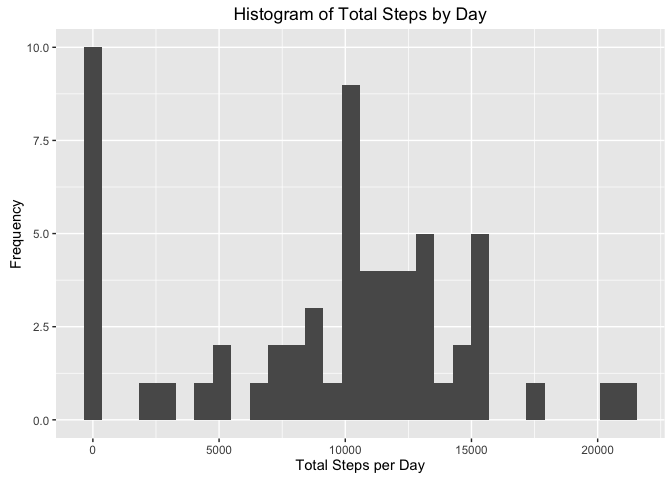
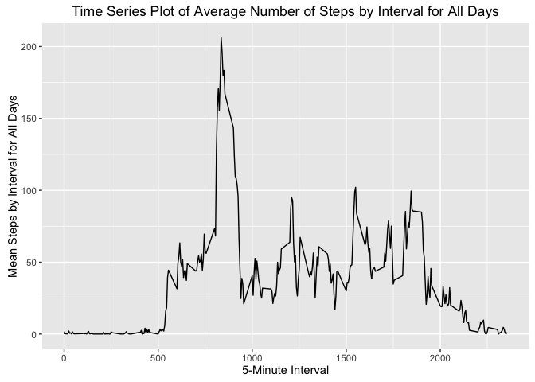
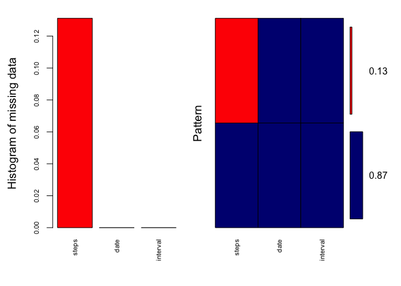
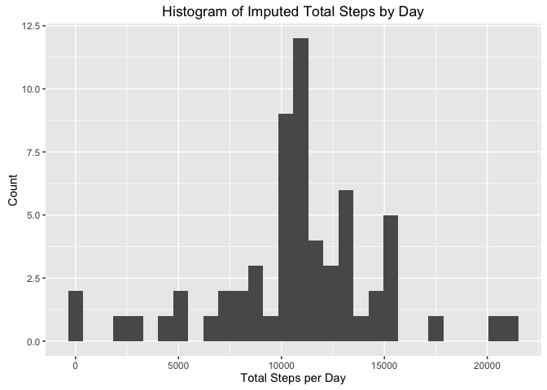
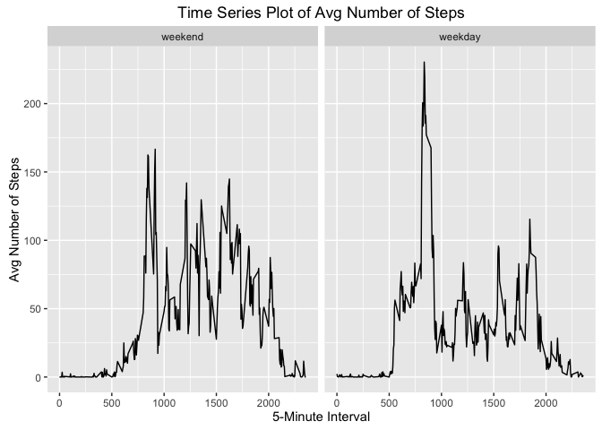

# Reproducible Research: Peer Assessment 1


## Loading and preprocessing the data
The first step is to load our required libraries. 


```r
library(lubridate)
library(ggplot2)
library(dplyr)
```

Then we unzip the data and read it into a dataframe. 

```r
zip <- unzip("activity.zip")
activity <- read.csv(zip)
```


## What is mean total number of steps taken per day?
To answer this question we will be ignoring all missing values in the dataset. Our approach will be to:

- calculate the total number of steps taken per day    
- make a histogram of the total number of steps taken each day   
- calculate the mean and median of the total number of steps taken per day.   

#### Calculating the total number of steps taken each day
We will rely on lubridate to make this calculation easier. By using date objects we can do some easier date math as needed. 


```r
activity$date <- ymd(activity$date)

activity.by.day <- activity %>% 
        group_by(date) %>% 
        summarise(total_steps_by_day = sum(steps, na.rm = T))
```

#### Histogram of the total number of steps taken each day
The histogram below lets us see what the data looks like. 

```r
steps.by.day.plot <- ggplot(data = activity.by.day, aes(total_steps_by_day))
steps.by.day.plot + geom_histogram() + 
        labs(x = "Total Steps per Day", y = "Frequency") + 
        ggtitle("Histogram of Total Steps by Day")
```

<!-- -->


#### Calculating the mean and median of the total number of steps taken per day.   
The code below will calculate the mean and median for the total number of steps taken per day.


```r
mean(activity.by.day$total_steps_by_day)
```

```
## [1] 9354.23
```

```r
median(activity.by.day$total_steps_by_day)
```

```
## [1] 10395
```

As we see above, the mean is: 9354.2295082 and the median is: 10395. 


## What is the average daily activity pattern?
In order to answer this question, our approach will be to: 

- make a time series plot of the 5-minute interval (on the x-axis) and the average number of steps taken, averaged across all days (on the y-axis);
- calculate which 5-minute interval, on average across all days in the dataset, contains the maximum number of steps.

#### Time series plot 
In order to create our time series plot, we must calculate the mean across each interval. 


```r
activity.by.interval <- activity %>%
        group_by(interval) %>%
        summarise(interval_mean = mean(steps, na.rm = T))
```

Then we can create our plot. 

```r
time.plot <- ggplot(data = activity.by.interval, aes(interval, interval_mean))
time.plot + geom_line() + 
        labs(x = "5-Minute Interval", y = "Mean Steps by Interval for All Days") + 
        ggtitle("Time Series Plot of Average Number of Steps by Interval for All Days")
```

<!-- -->

#### 5 Minute interval with max number of steps on average across all days
Visually, we can see that there is a pronounced spike in average between interval 500 and 1000. We can quantify the specific interval that has the maximum average value through a filter method. 


```r
filter(activity.by.interval, interval_mean == max(interval_mean))
```

```
## # A tibble: 1 × 2
##   interval interval_mean
##      <int>         <dbl>
## 1      835      206.1698
```

Here we can see that interval 835 has the highest average number of steps at 206. 


## Imputing missing values
We will impute missing data to get a clearer picture for our analysis. Our approach will be: 
- calculate the total number of missing values in the dataset;  
- devise a strategy for filling in all of the missing values;  
- create a new dataset that is equal to the original but with missing data imputed;  
- make a histogram of the total number of steps taken each day and calculate the mean and median total steps taken each day using the new dataset. 
- draw a comparison of the impact of imputing missing data on the mean and median.  

#### Calculate the total number of missing values in the dataset
The total number of missing values in the dataset are: 

```r
sum(is.na(activity))
```

```
## [1] 2304
```

While we can see the total number of missing values, 2304, we know nothing about where the values are missing. We can create a plot with some calculated data using the following code. 


```r
library(VIM)
aggr.plot <- aggr(activity, col = c('navyblue', 'red'),
                  numbers=TRUE, sortVars=TRUE, labels=names(activity),
                  cex.axis=.7, gap=3, ylab=c("Histogram of missing data", "Pattern"))
```

<!-- -->

```
## 
##  Variables sorted by number of missings: 
##  Variable     Count
##     steps 0.1311475
##      date 0.0000000
##  interval 0.0000000
```


#### Strategy for imputing missing data
In the plot above, we see that all of our missing data is in the `steps` column and the percentage of missing data is 13%, which is considered high. A general rule of thumb is that missing data should not comprise more than 5% of the total data points. 

Given the high percentage, it is safer to use a simple imputation method, such as the mean. Using the mean avoids introducing a bias of the mean itself, but it will affect the variance of the dataset. 

We will accept the risks of affecting variance and use the mean of the interval for all days as to impute the missing data. 

#### Create a new dataset with imputed data
In the code below we group by the interval and assign our chosen strategy for imputing missing data to a new dataframe. 


```r
imputed_activity <- activity %>%
        group_by(interval) %>% 
        mutate(steps = ifelse(is.na(steps), mean(steps, na.rm = T), steps)) %>%
        ungroup(interval)
```

#### Histogram of the total number of steps taken each day using imputed dataset


```r
imputed.activity.by.day <- imputed_activity %>% 
        group_by(date) %>% 
        summarise(total_steps_by_day = sum(steps, na.rm = T))

imputed.steps.by.day.plot <- ggplot(data = imputed.activity.by.day, aes(total_steps_by_day))
imputed.steps.by.day.plot + geom_histogram() + 
        labs(x = "Total Steps per Day", y = "Count") + 
        ggtitle("Histogram of Imputed Total Steps by Day")
```

<!-- -->

#### Calculating the mean and median of the total number of steps taken using imputed dataset


```r
mean(imputed.activity.by.day$total_steps_by_day)
```

```
## [1] 10766.19
```

```r
median(imputed.activity.by.day$total_steps_by_day)
```

```
## [1] 10766.19
```

We can see that the effect of imputing missing data is an increase in both the mean and the median. This makes sense since we used the mean of the intervals for the imputed missing data which then gets summed in our total steps by day. Previously, we removed the NAs, so our net sum was lower. 


## Are there differences in activity patterns between weekdays and weekends?
To answer this question, we need to modify our dataframe to add the type of day, either weekend or weekday. We will use the imputed missing data dataframe.  


```r
wkdays <- c("Monday", "Tuesday", "Wednesday", "Thursday", "Friday")
imputed_activity$day_type <- factor((weekdays(as.Date(imputed_activity$date)) %in% wkdays),
                                             levels = c(FALSE, TRUE), labels = c("weekend", "weekday"))

imputed_activity.summary <- imputed_activity %>%
        group_by(day_type, interval) %>%
        summarise(mean = mean(steps))
```

Now we can create a plot to answer our question. 


```r
weekday.vs.weekend.plot <- ggplot(data = imputed_activity.summary, aes(interval, mean))
weekday.vs.weekend.plot + geom_line() + facet_wrap(~ day_type) +
        labs(x = "5-Minute Interval", y = "Avg Number of Steps") + 
        ggtitle("Time Series Plot of Avg Number of Steps")
```

<!-- -->

The weekend activity is more uniform then the weekday activity. Furthermore, the overal activity is generally higher during the active intervals between 500 - 2000. 
